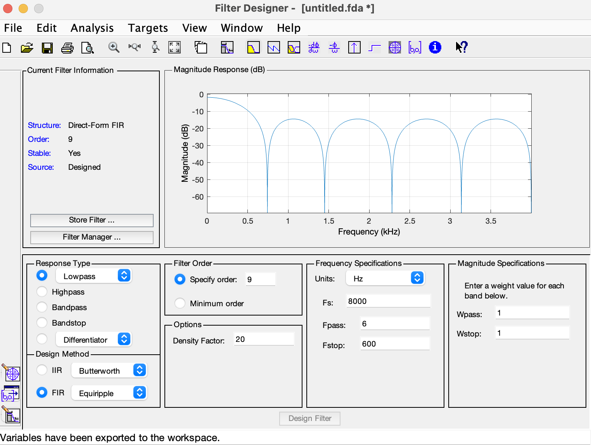
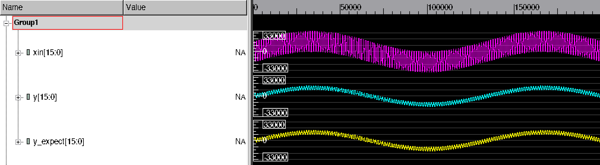

# fpga-dsp
This is a project trying to implement digital signal processing modules for FPGA using SystemVerilog.

### Reference:
https://github.com/ahmedshahein/DSP-RTL-Lib.git 
https://www.hackster.io/whitney-knitter/dsp-for-fpga-simple-fir-filter-in-verilog-91208d

### FIR module (additional images)

